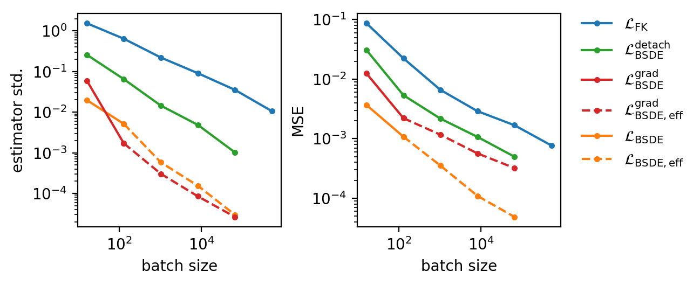

# Robust SDE-Based Variational Formulations for Solving Linear PDEs via Deep Learning

> Accompanying code for the ICML 2022 paper 'Robust SDE-Based Variational Formulations for Solving Linear PDEs via Deep Learning'. Implemented in [PyTorch](https://pytorch.org/), 
> experiment execution and tracking using [Weights & Biases](https://wandb.ai/).



## Setup

This code was tested with Python 3.9.7. 
All necessary packages are specified in [`requirements.txt`](requirements.txt) and can be installed with:

`pip install -r requirements.txt`.

You can test your setup by running `python main.py`.

## Quick start

Our code logs all metrics, plots, and model files to [Weights & Biases (W&B)](https://wandb.ai/).
By default, this is saved to an anonymous account, the link of which can be found in the output of the code. 

We specify our configs using `.yaml` files in the folder [`configs`](configs), 
which can be passed to the code using the environment variable `WANDB_CONFIG_PATHS` 
(comma-separated list, updated in order).

**Example:**
Learn the 50-dimensional heat equation using the base configuration, a Multilevel net, and the Feynman-Kac loss:

`WANDB_CONFIG_PATHS=configs/base.yaml,configs/problems/heat_50d.yaml,configs/models/mlnet.yaml,configs/solver/fk.yaml python main.py`.

## Sweeps 

In order to run experiments for a number of configurations, we use W&B sweeps.

First, define a sweep and copy the `<entity>/<project>/<id>` string as specified in the output:

`wandb sweep configs/sweeps/scaling_sweep.yaml`.

**Example:** 
To solve the heat equation as above with different batch sizes and losses,
one can start several agents with the following command:

`WANDB_CONFIG_PATHS=configs/base.yaml,configs/problems/heat_50d.yaml,configs/models/mlnet.yaml wandb agent <entity>/<project>/<id>`.

This iteratively pulls configurations from the W&B server and starts the corresponding experiment.

## Advanced Configuration
Change [`.env`](.env) to set up a suitable environment 
which will be automatically loaded in [`main.py`](main.py).
In doing so, you can log metrics to your personal W&B account.
You can also change this file with the `dotenv` package:
```
dotenv set WANDB_PROJECT <wandb project name>
dotenv set WANDB_ENTITY <wandb username or teamname>
dotenv set WANDB_API_KEY <wandb api key>
dotenv set WANDB_ANONYMOUS allow
```

